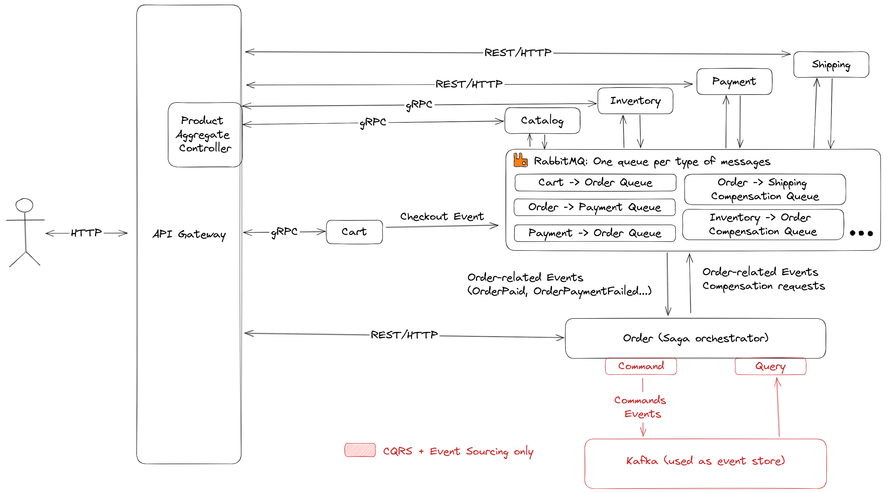
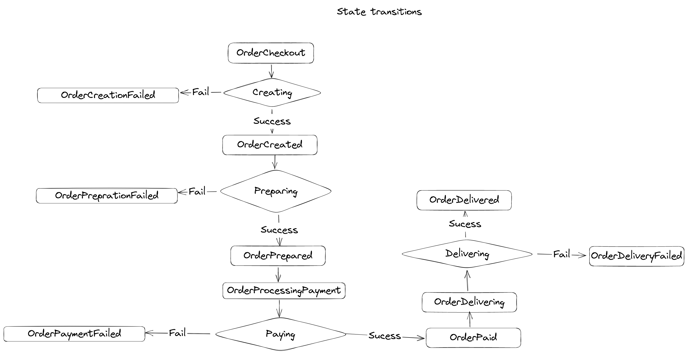

# Polystore

## Introduction
Polystore is a sample project that implements the Saga pattern, and the CQRS + Event sourcing pattern. It is a simple application that allows users to create and manage orders. The application is composed of the following components:

* **Order service**: Allows users to create and manage orders. It uses a relational database to store the orders.
* **Inventory service**: Allows users to manage the inventory of the products. It uses a relational database to store the inventory.
* **Payment service**: Allows users to manage the payments of the orders. It uses a relational database to store the payments.
* **Cart service**: Allows users to manage the cart of the orders. It uses a Redis database to store the cart.
* **Catalog service**: Allows users to manage the catalog of the products. It uses a MongoDB database to store the catalog.
* **Gateway service**: Exposes the APIs of the services above. It uses Spring Cloud Gateway to route the requests to the services.
* **Shipping service**: Allows users to manage the shipping of the orders. It uses a relational database to store the shipping.

## Architecture
The following diagram shows the architecture of the application:



For the saga pattern, the sequence is simple: the order service is responsible for sending the events to the other services. The other services are responsible for updating their state when they receive an event. The order service is also responsible for sending the compensating events when an error occurs.

Here is are the state transitions of the saga:



I've decided to do an orchestrated saga because it is easier to implement and to keep track of where the saga is. However, it is not as scalable as a choreographed saga.

## Running the application
The application can be run locally using Docker Compose. The following command starts all the services:

```
sudo docker-compose up
```

To start all the microservices, you can use the following command:

```
mvn clean install -DskipTests=true
mvn exec:java -pl cart -Dexec.mainClass="fr.polytech.polystore.cart.CartApplication" &
mvn exec:java -pl inventory -Dexec.mainClass="fr.polytech.polystore.inventory.InventoryApplication" &
mvn exec:java -pl payment -Dexec.mainClass="fr.polytech.polystore.payment.PaymentApplication" &
mvn exec:java -pl shipping -Dexec.mainClass="fr.polytech.polystore.shipping.ShipmentApplication" &
mvn exec:java -pl gateway -Dexec.mainClass="fr.polytech.polystore.gateway.GatewayApplication" &
mvn exec:java -pl catalog -Dexec.mainClass="fr.polytech.polystore.catalog.CatalogApplication" &
mvn exec:java -pl order -Dexec.mainClass="fr.polytech.polystore.order.OrderApplication" 
```

You need at least Java 19 to run the application. The previous command will mix the logs of the different services. To see the logs of a specific service, please run each one individually.

## Using the application
First, add some products to the catalog using the following command:

```
curl -X POST -H "Content-Type: application/json" -d '{"name": "Product 1", "price": 10, "quantity": 60}' http://localhost:8080/api/v1/products
```

To use the frontend, you need to run the following command:

```
git clone https://github.com/lucido-simon/cdp-frontend && cd cdp-frontend && npm install && npm start
```

## Deploying the application

Disclaimer: This only works on the CQRS + Event Sourcing tag.

To deploy the application, you will need the following tools:

* [ansible](https://docs.ansible.com/ansible/latest/installation_guide/intro_installation.html)
* [k3d](https://k3d.io/)
* [kubectl](https://kubernetes.io/docs/tasks/tools/)
* [helm](https://helm.sh/docs/intro/install/)
* [terraform](https://learn.hashicorp.com/tutorials/terraform/install-cli)
* [kubeseal](https://github.com/bitnami-labs/sealed-secrets#kubeseal)
* [nodejs](https://nodejs.org/en/download/)

CD into `ops/create_cluster` and edit the `inventory.ini` file to add the IP of your server. Then, run the following command:

```
ansible-playbook main.yaml
```

After this runs, you will find a `polystore` file in your `~/.kube` folder. Edit the file and replace the IP with the IP of your server. Set the `KUBECONFIG` environment variable to the path of the file.

Next, we need to preprate the secrets for our mongo, postgres, redis, rabbitmq, and kafka databases. To do this, CD into `ops/terraform/prod/secrets`. You will find an example folder. Please rename it to `secrets`. 

Then, CD into `ops/terraform/prod/k8s-cluster` and run the following command:

```
terraform init
terraform apply
```

Once this is done, you should have a Kubernetes cluster running on your server, with a PostgreSQL database, a MongoDB database, a Redis database, and a RabbitMQ server and a Kafka server.

Let's now configure the applications secrets. If you used the examples values, you will only need to change the sealed secrets of the applcations that use the PostgreSQL database. You will need to change the postgres-password value in the values.yaml file of the order, payment, inventory and shipping charts (in the `helm` folder). To do this, you will need to run the following command:

```
echo -n <app-name> | kubeseal --raw -n polystore --name <app-name>-secrets
```

For the order application, please use:
```
echo -n orders | kubeseal --raw -n polystore --name order-secrets
```

The last step is to actually deploy the microservices. To do this, CD into `helm` and run the following commands:

```
helm install -n polystore catalog catalog/chart &&
helm install -n polystore cart cart/chart &&
helm install -n polystore order order/chart &&
helm install -n polystore inventory inventory/chart &&
helm install -n polystore payment payment/chart &&
helm install -n polystore shipping shipping/chart &&
helm install -n polystore gateway gateway/chart 
```

You should be all set ! The only thing missing is the frontend. Unfortunately, I didn't have time to deploy it. However, you can still run it locally and edit (in the frontend folder) the `src/config/apiConfig.ts` file to point to your server.
